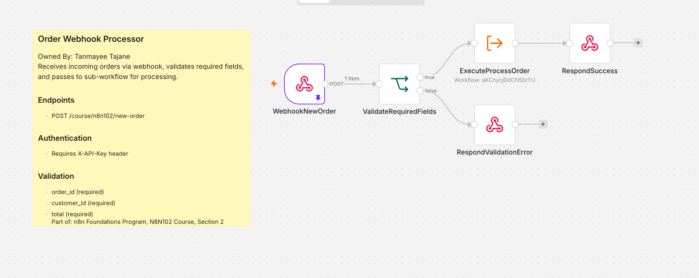
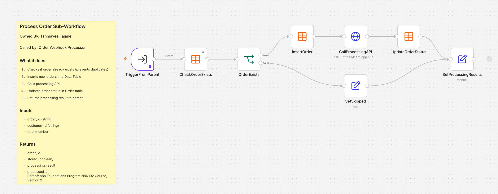
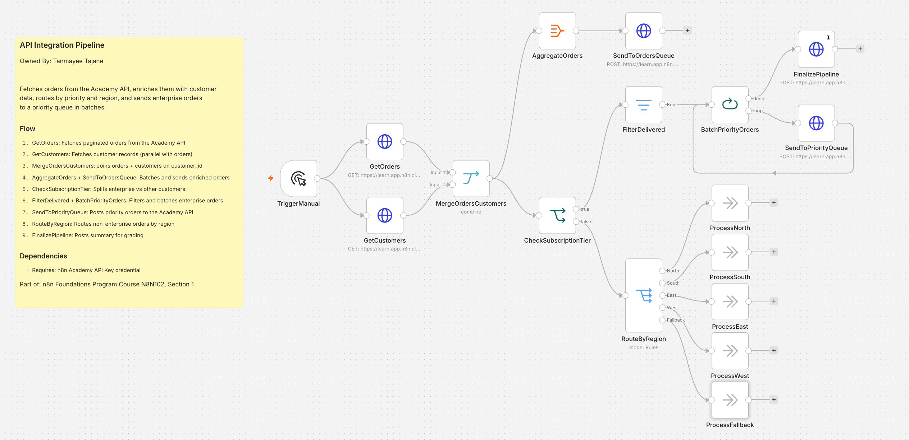
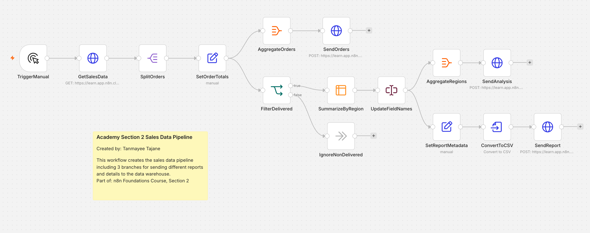

## Data Analytics-Driven Order Processing & Sales Automation Pipeline


An end-to-end data analytics and automation pipeline built with n8n that processes the complete order lifecycle—from ingestion of raw order data to enrichment, transformation, segmentation, and final reporting for business insights.

This project demonstrates core data engineering and analytics concepts including workflow orchestration, REST API integration, data extraction and transformation (ETL), dataset merging, customer segmentation, conditional logic, batch processing, and automated reporting for downstream analytics consumption.

---

## Architecture Overview

```
Incoming Order
      │
      ▼
Order Webhook Processor
      │
      ▼
Process Order Sub-Workflow
      │
      ▼
Order Stored & Processed
      │
      ▼
API Integration Pipeline
      │
      ├────────► Enterprise Orders
      │               │
      │               ▼
      │      Priority Queue
      │
      └────────► Standard Orders
                      │
                      ▼
               Regional Routing
                      │
                      ▼
           Sales Data Pipeline
                      │
                      ▼
              Data Warehouse
```

---

# Workflow Flow

## Step 1 – Receive Incoming Orders

The automation begins with an HTTP webhook that accepts incoming order requests from external applications.

**Responsibilities**

* Receives new orders through a REST endpoint
* Validates required fields
* Authenticates requests using an API key
* Sends validated data to a reusable processing workflow

### Screenshot





---

## Step 2 – Process the Order

The reusable processing workflow handles business logic while keeping the webhook lightweight.

**Responsibilities**

* Prevent duplicate orders
* Store new orders in the Data Table
* Call an external processing API
* Update processing status
* Return processing results to the parent workflow

### Screenshot





---

## Step 3 – Enrich Orders with Customer Data

After orders have been processed, the integration pipeline retrieves additional business information.

**Responsibilities**

* Fetch paginated orders
* Retrieve customer records in parallel
* Merge customer and order data
* Create enriched order objects


## Step 4 – Intelligent Order Routing

Business rules determine how each order should be processed.

### Enterprise Orders

* Identify enterprise customers
* Filter eligible orders
* Batch priority orders
* Send batches to the priority queue

### Standard Orders

* Route by geographical region
* Prepare for downstream processing

### Screenshot





---

## Step 5 – Sales Reporting Pipeline

The final stage prepares processed sales data for analytics.

**Responsibilities**

* Split workflow into multiple reporting branches
* Generate reporting datasets
* Deliver reports to the data warehouse

### Screenshot





---

# Technologies Used

* n8n
* REST APIs
* HTTP Webhooks
* API Authentication
* Parallel Execution
* Conditional Logic
* Data Transformation
* Batch Processing
* Queue-Based Processing
* Data Tables
* Reusable Sub-Workflows

---

# Key Features

* End-to-end order automation
* Modular workflow architecture
* Reusable sub-workflows
* Duplicate order prevention
* Customer data enrichment
* Enterprise priority handling
* Region-based routing
* Automated reporting pipeline
* API integrations
* Workflow orchestration

---

# Repository Structure

```
.
├── workflows/
│   ├── order-webhook.json
│   ├── process-order.json
│   ├── api-integration-pipeline.json
│   └── sales-data-pipeline.json
│
├── images/
│   ├── order-webhook.png
│   ├── process-order.png
│   ├── api-integration.png   
│   └── sales-pipeline.png
│
└── README.md
```

---

# What This Project Demonstrates

This project showcases the design of a production-style automation platform using n8n. It combines webhook-based event processing, API integrations, reusable workflow components, business-rule routing, parallel execution, batching, and reporting into a single end-to-end solution that models a real-world order processing system.
